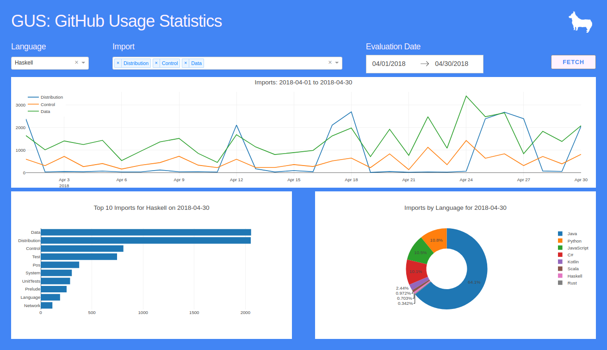

# GUS: GitHub Usage Statistics for Daily Imporyt Monitoring: Insight Data Engineering Project 18B

## Description
GUS is a tool for monitoring import statements that appear in patch files for GitHub repositories.
The data come from GitHub by way of [GHTorrent.org](http://ghtorrent.org/).
Each patch file in the dumps provided by GHTorrent is parsed for inclusions and exclusions
of import statements. These import statements are aggregated by date.

## Dashboard
The results of this project can be seen [here](http://ec2-52-36-220-17.us-west-2.compute.amazonaws.com:8000/).
.

## Workflow
The data is pulled from GHTorrent.org daily. The commits are extracted and placed into HDFS.
From there, Spark parses the patch files and performs aggregations on the results.
This data is fed to CockroachDB by way of an Elastic Load Balancer.
Some final small aggregations in CockroachDB. The dashboard is powered by Dash.

The entire process is automated by Airflow so that the data can be downloaded and processed without intervention.

## Architecture

