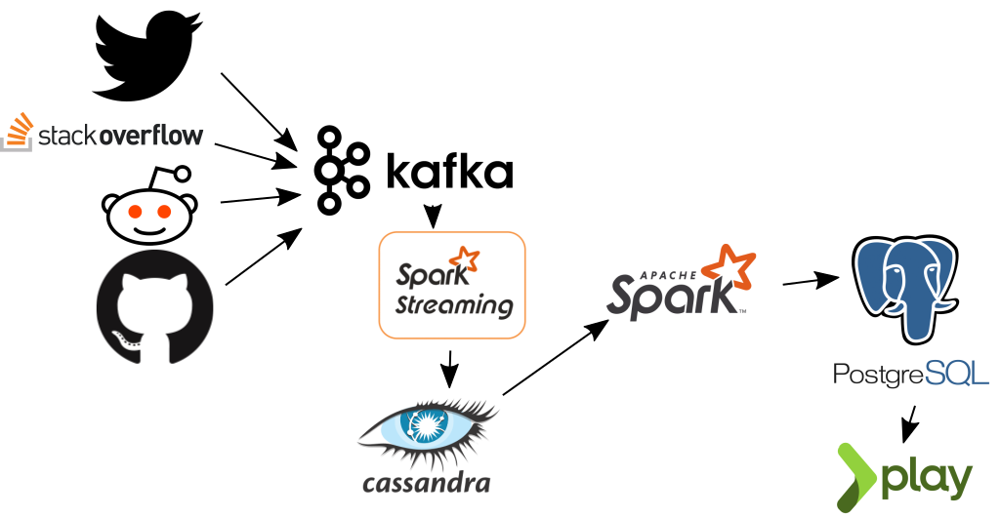

# Insight Data Engineering Project 18B

## Project Idea (1-sentence):
Monitor package usage and discussion to enable content creators to gain insights into new and trending packages.

## What is the purpose, and most common use cases?
Provide an analytics dashboard monitoring package usage and discussion in social media to gain insights into popularity of packages.

### Primary Use Case:
Give content creators a sense of which packages are used and trending.

### Secondary Use Cases:
* Create Sweet Blogs About New and Interesting Packages
* Understand Package Adoption and Churn
* Write Books
* Enable Developers to Understand Package Usage
* Give developers a sense of which packages are being used for what purposes in their language of choice
* Tracking a user's use of a package. I.e. determining if a particular user actually knows a given package.

## Metrics
The main purpose here will be to track which packages are trending.

### Primary Metric
The primary metric, *popularity*, will be a weighted sum of the following:
* *insertions - deletions* of package in git hub diff files
  * normalize this by the total number of packages used
  * possibly restrict this to *active* repositories
* *mentions* of the package on various social media platforms
  * this needs to be normalized in some way
  * or it could be just a simple boost to the previous (purely additive)

Use the above to determine *trending* packages.
[This link](https://stackoverflow.com/questions/787496/what-is-the-best-way-to-compute-trending-topics-or-tags) might be useful.

### Secondary Metrics
Some possible secondary metrics to include if
* Package "Churn"
* Package inclusion normalized by "active" repositories
* Which functions are being used?

### Dimensions:
* Programming Language?
* Domain (i.e. slicing by "dataframes" provides results for Pandas etc)?

## Which technologies are well-suited to solve those challenges? (list all relevant)
* Ingestion and Processing
  * Kafka
  * Spark Streaming
  * Spark
* Storage
  * AWS Redshift
  * Casandra
  * Vertica
  * CouchDB
  * Riak
  * MySQL
  * PostgreSQL
* Front End
  * Play Framework

## Proposed architecture

